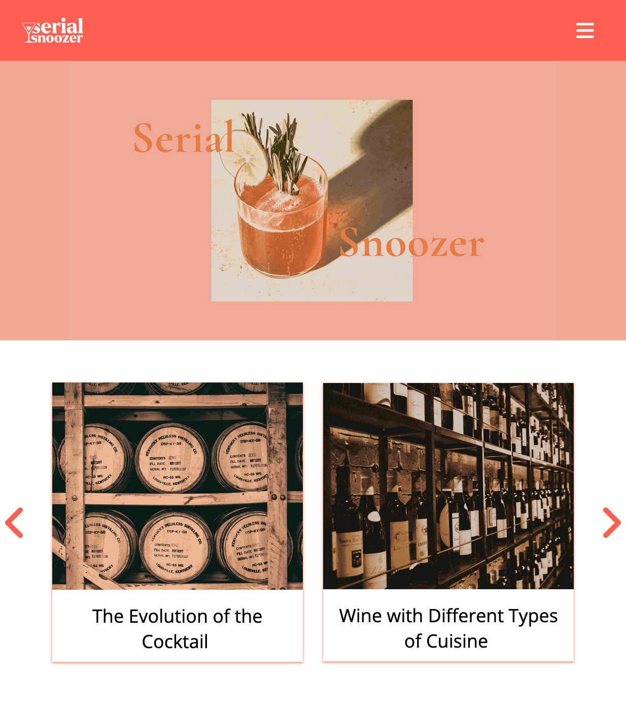

# <a href="https://exam1serialsnoozer.netlify.app/">Cross-course project</a>

This site is my exam after two semesters at Noroff School of Technology.

## Description

In exam 1 we were to create a blog, where I chose the theme of bartending and drinks. The target group was young adults (ages 20-35) with interests in food and drink, but not much prior knowledge and experience. 

## Technologies Used

<ul>
    <li>HTML5</li>
    <li>CSS</li>
    <li>JavaScript</li>
    <li>PHP</li>
    <li>WordPress</li>
</ul>

## Running

To view the page, copy this link:

    https://exam1serialsnoozer.netlify.app/

## Contact

<a href="https://www.linkedin.com/in/eirin-rydland-944b49210">My LinkedIn page</a>

## Acknowledgments

Thanks to my teachers, Jon og Lasse, for teaching me how to program and thanks to my graphic designer (sister), Kristin, for making the logo for me.
